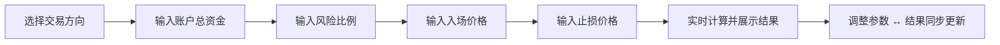

## 1. 产品概述

将已有的 Python 多空通用固定风险比例仓位计算器转化为本地运行的交互式网页应用，提供更直观的输入体验和即时的计算结果可视化展示。

- 目标用户：加密货币交易者，用于计算基于固定风险比例的仓位大小
- 核心价值：将命令行工具升级为可视化界面，降低使用门槛，提升交互体验

## 2. 核心功能

### 2.1 功能模块

1. **交易参数输入表单**：方向选择（做多/做空）、账户总资金、风险比例、入场价格、止损价格
2. **实时计算与结果展示**：输入即计算，实时展示停车距离、最大亏损、仓位数量、名义价值、风险敞口
3. **结果可视化**：以卡片形式展示计算结果，配合进度条/仪表盘直观展示风险敞口比例
4. **输入校验与错误提示**：沿用 Python 工具的校验逻辑，前端实时校验并给出明确错误提示

### 2.2 页面详情

| 页面名称 | 模块名称 | 功能描述 |
|----------|----------|----------------|
| 首页 | 交易方向选择 | 做多/做空切换按钮，高亮当前选中方向 |
| 首页 | 参数输入区 | 账户总资金、风险比例、入场价格、止损价格输入框，带实时校验 |
| 首页 | 结果展示区 | 6项计算结果卡片展示，带数值精度格式化 |
| 首页 | 风险仪表盘 | 风险敞口占比进度条/环形图可视化 |

## 3. 核心流程

用户进入页面后，选择交易方向，依次填写参数，页面实时计算并展示结果。

## 4. 用户界面设计

### 4.1 设计风格

- **主色调**：深色主题（#0f0f1a 背景），搭配霓虹青绿（#00f0a0）作为主色，橙红（#ff4444）作为做空方向色
- **按钮风格**：圆角矩形，带微光效和悬停动画
- **字体**：显示字体使用 Orbitron（科技感），正文使用 JetBrains Mono（等宽字体契合交易工具场景）
- **布局风格**：单页卡片式布局，顶部方向选择，中间参数输入，底部结果展示，信息流自上而下
- **背景**：深色渐变背景搭配微妙网格纹理，营造交易终端氛围

### 4.2 页面设计概览

| 页面名称 | 模块名称 | UI 元素 |
|----------|----------|----------|
| 首页 | 方向选择 | 两个并排大按钮（做多/做空），选中状态带发光边框 |
| 首页 | 参数输入 | 圆角输入框，左侧带 $/% 前缀图标，底部校验提示文字 |
| 首页 | 结果展示 | 6个数据卡片 2x3 网格排列，每个卡片含标题、数值、单位 |
| 首页 | 风险仪表盘 | 环形进度条，颜色随风险比例变化（绿→黄→红） |

### 4.3 响应式

桌面优先设计，最小宽度 320px 适配移动端，输入区和结果区在窄屏下自动纵向堆叠。add1