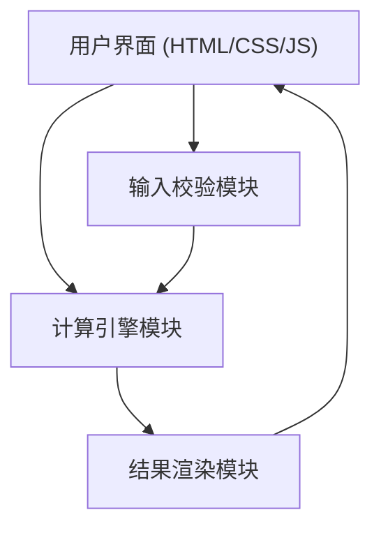

## 1. 架构设计

单页面应用架构，纯前端实现，无后端服务依赖。所有计算逻辑在浏览器端 JavaScript 中完成。



## 2. 技术选型

- **前端**：原生 HTML + CSS + JavaScript（无框架，零依赖）
- **构建工具**：无（纯静态页面，直接浏览器打开即可运行）
- **后端**：无
- **字体来源**：Google Fonts（Orbitron + JetBrains Mono）
- **部署方式**：本地直接打开 index.html 即可运行

## 3. 目录结构

```
position management/
├── index.html          # 主页面
├── style.css           # 样式文件
├── script.js           # 计算逻辑与交互
├── .trae/documents/
│   ├── prd.md
│   └── technical-architecture.md
├── position_calculator.py  # 原有 Python 工具
└── test_calculator.py      # 原有测试脚本
```

## 4. 核心模块设计

### 4.1 校验模块（validate.js 内联于 script.js）

| 字段 | 校验规则 | 错误提示 |
|------|----------|----------|
| 交易方向 | 必须选择做多或做空 | "请选择交易方向" |
| 账户总资金 | > 0 | "账户总资金必须为正数" |
| 风险比例 | > 0 且 ≤ 100 | "风险比例须在 1-100 之间" |
| 入场价格 | > 0 | "入场价格必须为正数" |
| 止损价格 | 做多时 < 入场价，做空时 > 入场价 | "做多场景下止损价须小于入场价" |

### 4.2 计算引擎（calculate 函数）

```javascript
stopDistance = Math.abs(entryPrice - stopPrice);
maxLoss = totalCapital * (riskPercent / 100);
positionSize = maxLoss / stopDistance;
notionalValue = positionSize * entryPrice;
riskExposureRatio = (notionalValue / totalCapital) * 100;
```

### 4.3 数据流

```
用户输入 → onInput/onChange 事件 → 校验 → 计算 → 更新 DOM
                                  ↓
                           校验失败 → 显示错误信息 → 清空结果
```

## 5. 无后端

纯静态页面，不涉及任何后端服务、数据库或 API 调用。所有计算在客户端即时完成。